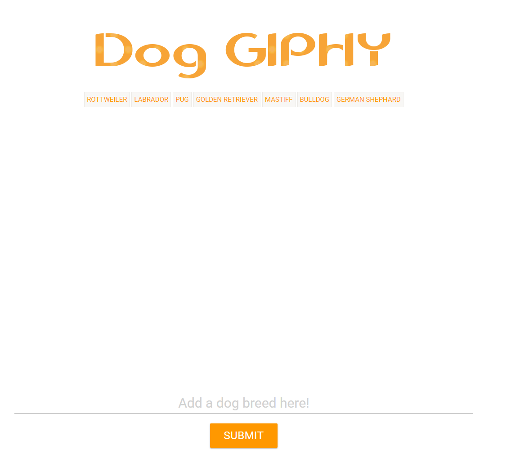
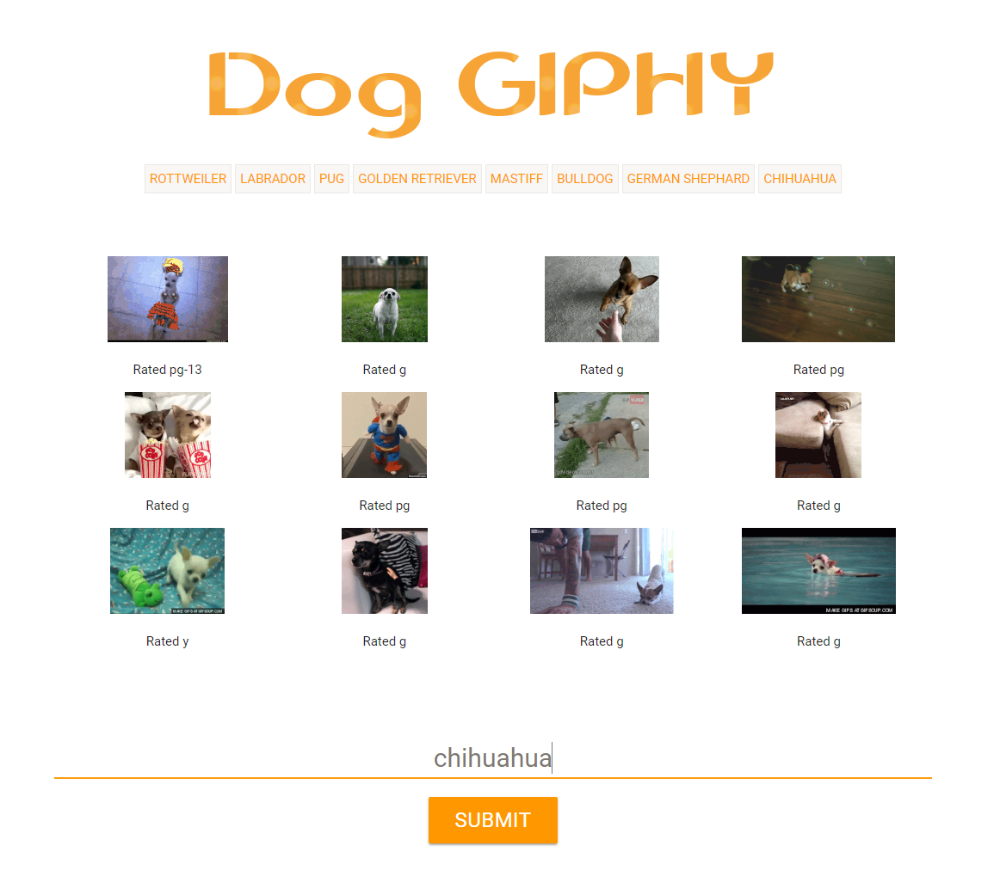

# GIPHY

### Used the GIPHY API to make a dynamic web page that populates with dog gifs of your choice.  JavaScript and JQuery was used to change the HTML of the page.

* Whenever a user submits a dog breed (ex: chihuahua), the app will take it and add the text to an array that will create and append a button with the text at the top.

* When the user clicks on a button, the page should grab 12 static, non-animated gif images from the GIPHY API and place them on the page. 

* When the user clicks one of the still GIPHY images, the gif should animate. If the user clicks the gif again, it should stop playing.

* Under each gif, the rating (PG, G, etc) will be displayed.  This data is provided by the GIPHY API.

## GitHub Repo: https://lponder82.github.io/Giphy/

## Screenshot

## Languages/Libraries used:

* Javascript
* JQUERY

